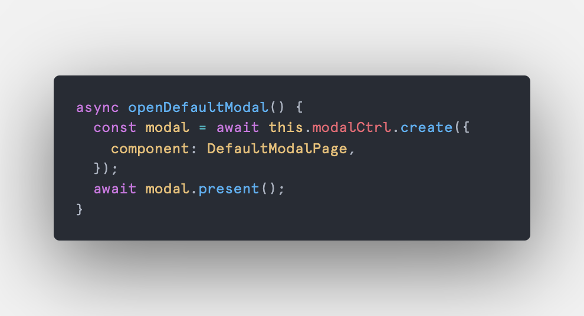
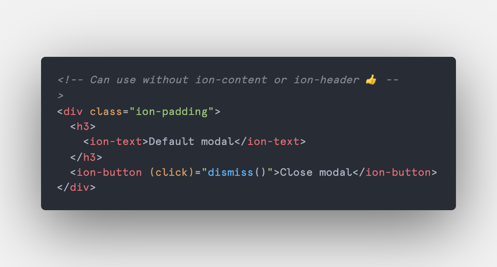
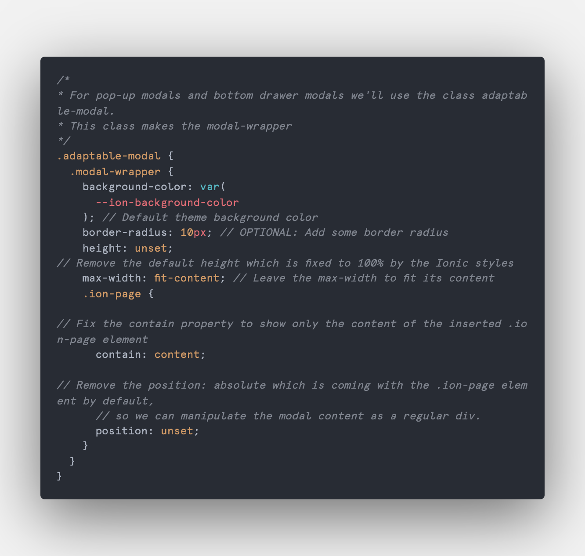
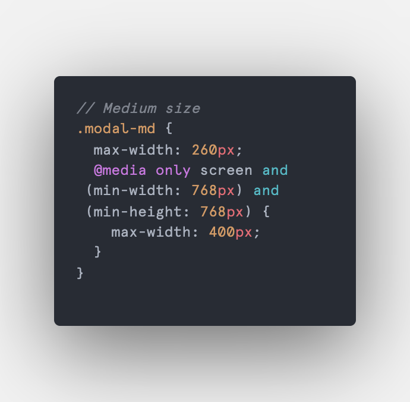
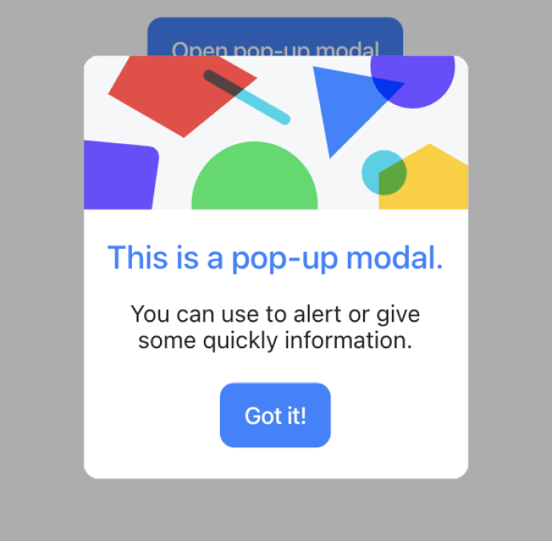
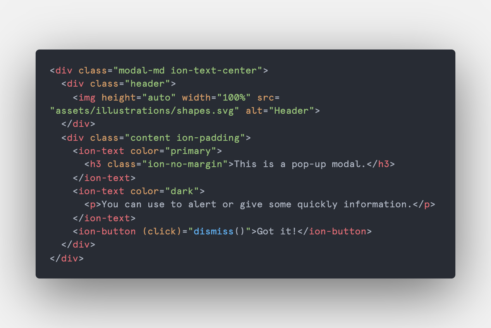
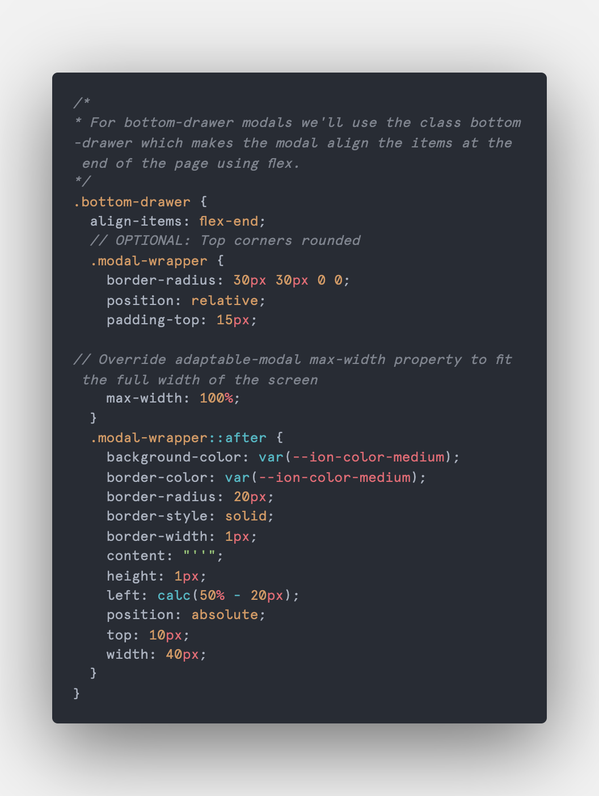
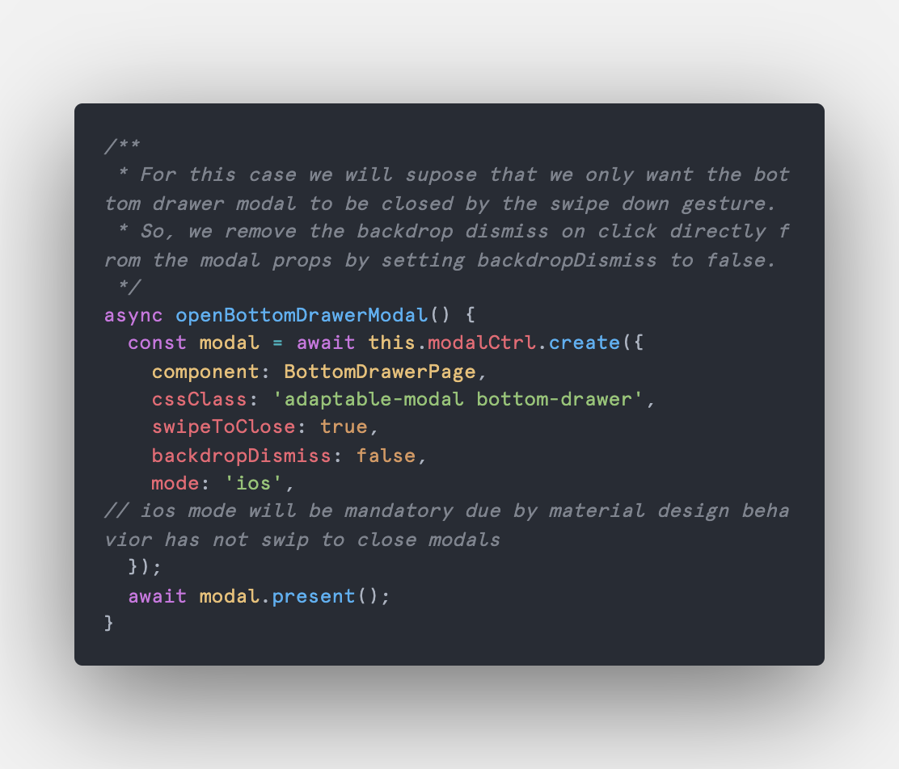

# Manipulating Ionic modals

_A modal (also called a modal window or lightbox) is a web page element that displays in front of and deactivates all other page content. To return to the main content, the user must engage with the modal by completing an action or by closing it. Modals are often used to direct users’ attention to an important action or piece of information on a website or application.
~_ **[Jamie Juviler - HubSpot.](https://blog.hubspot.com/website/modal-web-design)**

Having this definition in mind we jump to a question, what do we expect from a modal window in our apps?.

**Answer:** Well, for Ionic Framework a modal will be a window that will use the whole screen size every time.

But, we don't always need this fullscreen windows, sometimes we just need an alert/dialog, a popup, a drawer or we just want to highlight an image in the middle of the screen.

There are two main behaviours that Ionic gives to its modal component.

1. Fullscreen size
2. OS System defaults

At this point you've to be aware that we won't stick to iOS or Android, we will use the best of both in case we need, or why not, avoid using them.

For this suggestion we will define 3 common use cases you may have in your project.

- The default modal (which is the way Ionic likes)
- The pop-up modal
- The bottom drawer modal

Curiously Ionic Framework already has these 3 components very clear and specifically separate, ion-modal, ion-alert, ion-action-sheet. You can find them in the [Ionic Docs](https://ionicframework.com/docs/components).

**Disclaimer**: Unfortunately, Ionic is too strict about customising its core components, specially these 3, and here is **why** this post was created. Manipulate Ionic modals in order to create custom pop-ups and drawers. Sounds good, isn't?

Live example

## Default modal

For this particular case we won't discuss too much about it. Just use the default way to create modals in Ionic and that's it. The only notable change here is that we are forcing the ion-backdrop to appear in every single modal, which is different to the default behaviour (backdrop only for the first modal). You can see the backdrop becomes darker after each consecutive modal you open.

Code example:

Typescript

HTML

## Pop-up modal

In this case (the most common one) we are looking for an alert/popup-like component, where you can highlight a small piece of content and keep (or not?) the "dismiss on backdrop clicked" behaviour. In order to keep this options available we will keep using the modal instance options, in this case will be the **backdropDismiss** property, by default this prop is true so we don't have to change anything, but in case you don't want to dismiss the modal when the backdrop is clicked just set the property to false.

For the pop-up modal as well as the bottom-drawer modal we will use the **_.adaptable-modal_** class.

Adaptable modal class

Depending on the project (actually the design team), you will customise the content size of your modal components as you need. Here are 5 common sizes you can use: **xs, sm, md, lg** and **xl.**

PopUp medium size modal class

PopUp medium size modal

Pop-up modal html

As you can see there is a slightly difference in the pop-up width, here is where you customise sizes as much as you need.

Creating and opening a popup modal.

PopUp modal typescript

## Bottom drawer

The purpose of the bottom drawer is allow users to close it swiping it down. Android doesn't has this feature natively so we force the mode to be iOS. We also add the **swipeToClose** property to **true.** With the bottom-drawer class we set the items inside the ion-modal component to be positioned at the bottom of the page and override the previous assigned width to 100%, in order to always fit the screen width, even on tablet screen size.

Bottom drawer class

👈 **Optional:** Add the **after** pseudo-element to the modal wrapper. Create a top-bar indicator to visually let the user know that the bottom drawer is draggable.

Bottom drawer modal typescript

## Conclusions

Customisations can go as deep as we need, with this solution we tried to make modals less paining when you want to modify them, as well as integrate them in multiple ways to our projects.

Any feedback, comment or story around this topic will be appreciate it and replied ☕
